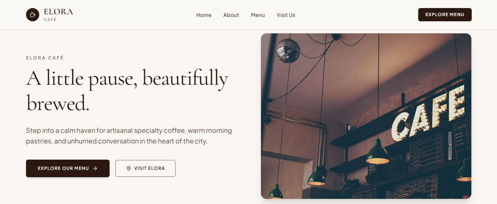
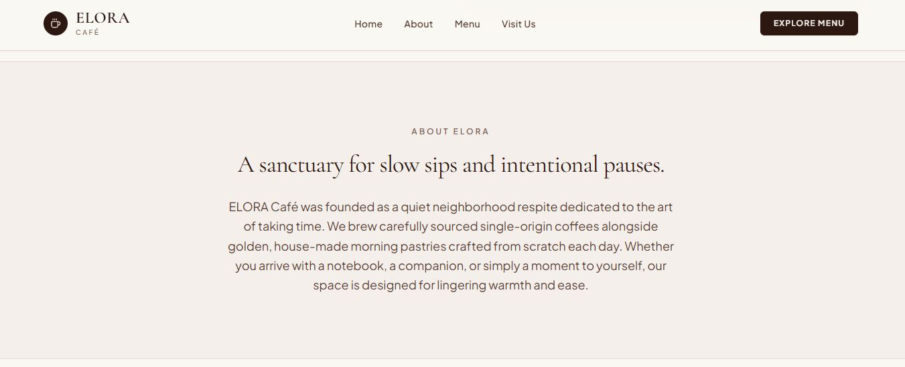
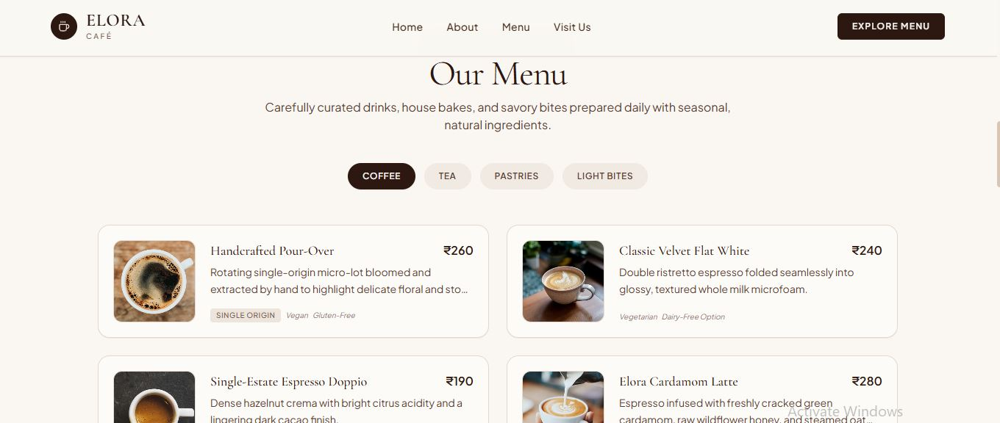

# ELORA Café — Prompt Engineering Project

## Overview

ELORA Café is a fictional café website created as a **Prompt Engineering and Generative AI portfolio project**.

The project demonstrates how structured, context-rich prompts can be used to develop a consistent brand identity, website content, visual direction, and responsive digital experience.

> **Note:** ELORA Café is a fictional brand created for portfolio and educational purposes.

## Key Focus

- Prompt Engineering
- Generative AI
- Visual & Creative Prompting
- AI-Assisted Website Development
- Iterative Prompt Refinement
- Brand & Content Generation

## Workflow

**Requirement → Prompt Design → AI Generation → Evaluation → Refinement → Final Website**

## Prompt Engineering Techniques

- Role Prompting
- Context Setting
- Task Definition
- Constraint-Based Prompting
- Structured Requirements
- Visual Prompting
- Composition Control
- Iterative Refinement
- Consistency Control
- Negative Instructions

## Technologies & Tools

- HTML
- CSS
- JavaScript
- Generative AI
- Prompt Engineering
- GitHub

## Author

**Elakiya R**  
B.Tech Artificial Intelligence & Machine Learning

**Focus Areas:** Generative AI · Prompt Engineering · LLM Applications · RAG · LangChain · Python
## DEMO Screenshots

### Home

### About

### Menu

### Visit Us

### Footer

